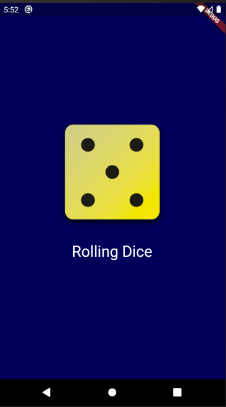

# Dice Rolling App

The Dice Rolling App is a simple mobile application built using Flutter that simulates rolling a dice. When you tap the screen, it will generate a random number between 1 and 6, simulating the outcome of rolling a six-sided dice.

## Features

- Tap the screen to roll the dice and get a random number between 1 and 6.
- Realistic dice animation on the screen.
- Simple and intuitive user interface.
- Responsive layout that works on various screen sizes..

## Technologies Used

- Flutter Framework: A cross-platform framework for building native mobile apps.
- Dart Programming Language: The programming language used for developing Flutter applications.

## Screenshots

